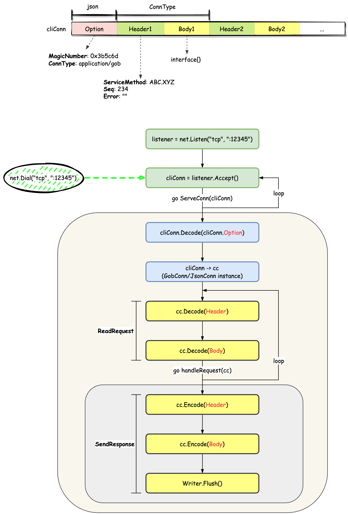

# demo
测试fastRPC服务端能否正常工作的Demo（模拟客户端的方式）
---
### demo架构图


Usage:
```bash
bash run.sh
```
Output:
```text
2023/03/17 22:28:32 start fastRPC server on 127.0.0.1:12345
2023/03/17 22:28:34 [fastRPC server] request header:  &{Foo.Sum 0 } , request argv:  test0
2023/03/17 22:28:35 [client] received: {Foo.Sum 0 } fastRPC resp 0
2023/03/17 22:28:35 [fastRPC server] request header:  &{Foo.Sum 1 } , request argv:  test1
2023/03/17 22:28:36 [client] received: {Foo.Sum 1 } fastRPC resp 1
2023/03/17 22:28:36 [fastRPC server] request header:  &{Foo.Sum 2 } , request argv:  test2
2023/03/17 22:28:37 [client] received: {Foo.Sum 2 } fastRPC resp 2
2023/03/17 22:28:37 [fastRPC server] request header:  &{Foo.Sum 3 } , request argv:  test3
2023/03/17 22:28:38 [client] received: {Foo.Sum 3 } fastRPC resp 3
2023/03/17 22:28:38 [fastRPC server] request header:  &{Foo.Sum 4 } , request argv:  test4
2023/03/17 22:28:39 [client] received: {Foo.Sum 4 } fastRPC resp 4
```